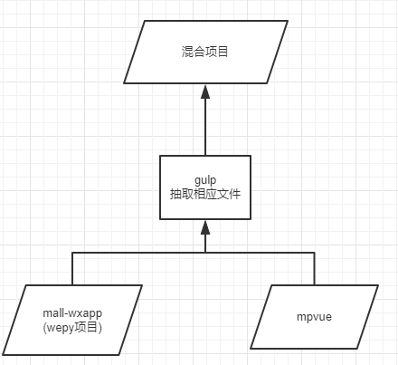

# mpvue_test

> A Mpvue project

## Build Setup

``` bash
# install dependencies
npm install

# serve with hot reload at localhost:8080
npm run dev

# build for production with minification
npm run build

# build for production and view the bundle analyzer report
npm run build --report
```

For detailed explanation on how things work, checkout the [guide](http://vuejs-templates.github.io/webpack/) and [docs for vue-loader](http://vuejs.github.io/vue-loader).

# 项目说明

## 思路


## 步骤
1. 将 mpvue_test 项目 放在 wepy 项目 同级文件夹
2. 运行 npm run dev || npm run build
3. 会生成 dist 文件夹 mpvue_dist(在同级目录)
4. 运行 gulp watch || gulp init 生成 mall_wxapp_final(最终项目)

## 注意点
1. config/externalsOptions.js 配置 webpack 的 externals 选项，让mpvue 直接使用 wepy 上的资源，如 api、utils等
2. config/lessLoaderOptions.js 配置 less 的引用规则，使 mpvue 直接可以 使用 wepy/style/*.less 文件， 如 @import "src/style/color"
3. config/router.js 配置 pages 的 入口 && 输出
4. mpvue_dist 文件 下 的 dep.json(组件依赖) && hash.json(文件hash) 是 为了 后面做页面分包用
5. vue 文件不打进vendor包，build/webpack.dev.conf.js:67

## 此方案解决问题
1. wepy 下 列表嵌套 循环 无法实现组件化，如: 二级分类页: swiperPages->goodsList 二次循环 -> 导致 Item 组件无法引用，Item 组件的维护变难，mpvue的列表循环实现较好，打算 嵌套循环页面用 mpvue 实现

## 性能
1. 用 npm run build -> vendor主包大小为47K(vue.js && vue->小程序层 的实现)


